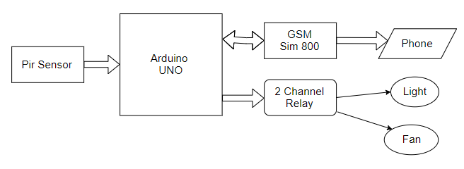
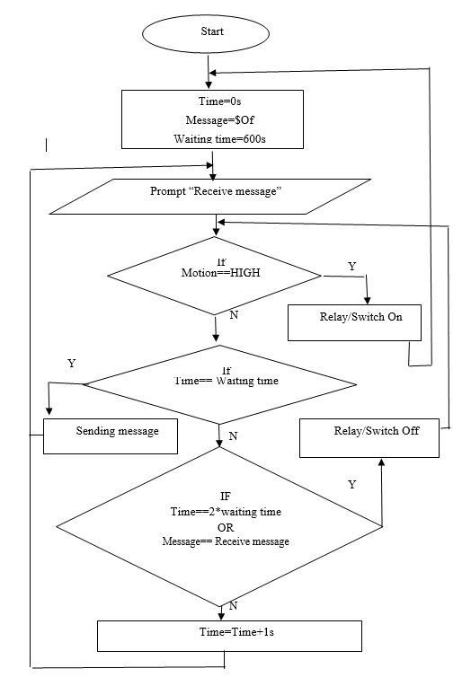

#       Automatic-Alert-Based-Switch-with-Motion-Sensor

## Proposed Model

The model has been built in two phases. At first, we have made an automatic switch which is controlled by PIR sensor and two channel relay. The relay will connect through power supply and electrical device (fan, light). In the second phase, GSM Module will notify users if Relay remains high for ten minutes without any movement of object. We have used GSM Module for both input and output purposes. The complete block diagram of our proposed model is given below.

###   1.PIR Sensor Controlled Switch
As shown in Figure, Arduino will take inputs from the PIR Sensor Module HC-SR501. PIR Sensor will detect the movement of object through emitting heat energy in a form of infrared radiation. So when anyone comes into a room it will take reading and pass it to Arduino. Then, Arduino will send signals to the Two Channel Relay which is an electrically operated switch. The Relay module mainly protects the switch from high voltage spike. As we want to control the Relay manually we have used NC1 and COM ports for output purpose. This picture will represent the complete flowchart of our project.

### 2.Alert Enabled Switch
In this second phase of the module, we have used SIM 800A GSM Module which is a mobile communication modem. GSM Module is capable of sending and receiving messages with a SIM Card. SIM 800A needs 5v-12v of range to activate it. That is why we have used USB Cable to give it power which runs at 5v. If Arduino cannot get any signals from PIR Sensor for 10 minutes, it will send message to the registered user. After that, User can turn off the switches through sending message from their mobile phone.

## Result Analysis

Time | PIR Sensor and Relay   |  GSM Action 
---- | ---------------------- | ----------------
10s| Motion detected and Relay on|	No action 
30s	|No motion detected and Relay on|	No action 
300s	|No motion detected and Relay on|	No action 
330s	|No motion detected and Relay on| 	Sending message
630s	|No motion detected and Relay off|	Sending message
